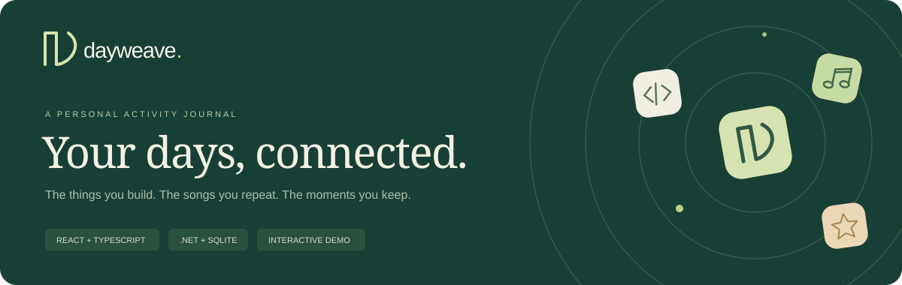

<div align="center">



# Dayweave

**A personal activity journal that brings your digital life into one thoughtful timeline.**

[](https://github.com/KhushiShah-swe/PersonalTimeline/actions/workflows/ci.yml)


[Explore locally](#try-the-demo-in-two-minutes) · [Architecture](docs/ARCHITECTURE.md) · [API & setup](docs/SETUP.md) · [Project evolution](docs/PROJECT_NOTES.md)

</div>

## Why Dayweave?

A commit, a favorite song, a video that taught you something, a moment you wrote down: they usually live in separate places. Dayweave brings them into one chronological journal so the activity around a day can become a story worth revisiting.

Originally named **PersonalTimeline**, this portfolio edition pairs a React/TypeScript interface with a C#/.NET API, account-scoped persistence, and provider adapters for GitHub, Spotify, and YouTube.

## Try the demo in two minutes

Requires **Node.js 22.13 or later**. Node 22 is used in CI.

```sh
git clone https://github.com/KhushiShah-swe/PersonalTimeline.git
cd PersonalTimeline/personal-timeline-client
npm ci
npm run dev
```

Open **http://localhost:3000** and choose **Explore the demo**.

The demo needs no API, database, OAuth account, or secret. It uses **fictional sample activity**, and edits persist in this browser. It does not connect to real provider accounts. Google Fonts may load for typography; system font fallbacks work offline.

Try this walkthrough:

1. Explore the overview and its activity counts and seven-day chart.
2. Open **Timeline**, search for a moment, and filter by source or date.
3. Use **Add a moment**, then edit it and verify it survives a refresh.
4. Export the currently filtered timeline as JSON.
5. Open **Connections** to inspect the provider cards or reset the demo.

For real account integration, follow the [full-stack setup guide](docs/SETUP.md).

## What it does

| Area | Implemented behavior |
| --- | --- |
| Overview | Counts actual entries, active dates, sources, and the last seven days of activity |
| Timeline | Groups activity by local calendar day; searches titles, descriptions, categories, and types |
| Filtering | Combines source, inclusive date range, search, and ascending/descending order |
| Personal moments | Validated add/edit forms, native modal dialogs, explicit delete confirmation |
| Export | Downloads the visible filtered entries as structured JSON |
| Demo workspace | Fictional data, local persistence, full manual CRUD, and a reset option |
| Real accounts | GitHub sign-in; Spotify and YouTube OAuth connections |
| Synchronization | On-demand and hourly provider sync with serialized SQLite operations |
| Access control | Bearer authorization and per-user queries; imported entries cannot be edited |
| Interface | Responsive navigation, visible keyboard focus, reduced-motion support, loading/error/empty states |

**Provider boundaries:** GitHub imports supported events from its latest events response; Spotify imports recently played tracks; YouTube imports up to ten liked-video playlist items per sync. Provider credentials, permissions, history windows, and availability govern real sync. This is not a complete lifetime archive or a real-time streaming service.

## Built with

| Layer | Technology |
| --- | --- |
| Client | React 18, TypeScript, React Router, Vite, CSS |
| Client data | React Context, Axios, localStorage for the demo and bearer session |
| API | C#, .NET 8 Minimal APIs, JWT bearer authentication, GitHub OAuth |
| Persistence | SQLite, Entity Framework Core 9, committed migrations |
| Sync | Typed HttpClient provider adapters, BackgroundService, a shared sync coordinator |
| Tests | Vitest, React Testing Library, xUnit, Moq, WebApplicationFactory |
| Automation | GitHub Actions: install, test, type-check, build, and upload the client build artifact |

## Repository guide

| Path | Purpose |
| --- | --- |
| `personal-timeline-client/src/pages/` | Overview, timeline, login, and connections |
| `personal-timeline-client/src/components/` | Shared navigation, entry cards, and modal editor |
| `personal-timeline-client/src/context/` | Session and timeline state; real/demo data paths |
| `personal-timeline-client/src/lib/` | Demo data, filtering, dates, URLs, session decoding, and HTTP client |
| `PersonalTimeline.API/` | Minimal API, models, migrations, validation, and OAuth/sync services |
| `PersonalTimeline.Tests/` | API integration, provider parsing, validation, and OAuth correlation tests |
| `docs/` | Setup, architecture, tradeoffs, and project evolution |

The existing .NET project and folder names are retained to preserve solution and migration identity. **Dayweave** is the product name; the repository slug is currently **PersonalTimeline**.

## Run the checks

```sh
# From personal-timeline-client/
npm test
npm run build

# From the repository root, with the .NET 8 SDK installed
dotnet restore PersonalTimeline.sln
dotnet test PersonalTimeline.sln --configuration Release
```

Tests exercise demo CRUD and persistence, combined filters, expired sessions, unsafe links, API ownership boundaries, validation, callback state rejection, and multi-user external-event uniqueness. The workflow badge above reports the current default-branch result.

Automated tests do not prove every browser layout or live OAuth integration. Desktop/mobile visual checks and real provider consent flows remain a manual verification step. See the [validation notes](docs/PROJECT_NOTES.md#validation).

## Engineering choices worth discussing

- **One product, two data paths:** a real authenticated API and an explicit browser-only demo let reviewers explore the same interface without provisioning credentials.
- **Dates mean what users expect:** edits convert local date/time inputs to UTC; the API returns UTC timestamps, and filtering uses local calendar dates.
- **User-scoped deduplication:** `(UserId, SourceApi, ExternalId)` allows two people to import the same external event without colliding.
- **Single-use OAuth state:** random, expiring nonces are bound to the user, provider, and initiating browser instead of exposing a raw user ID as state.
- **Honest connection states:** demo cards say “Sample data,” provider failures surface as failures, and counts come from loaded activity.

## Scope and next steps

Dayweave is a **portfolio prototype**, not a hosted production service. Before deployment with real personal data, add encrypted provider-token storage, stronger browser session protections, rate limiting, operational monitoring, and durable/distributed OAuth correlation and sync coordination. The current state store and semaphore are designed for one API process. See [architecture and limitations](docs/ARCHITECTURE.md).

Planned work is tracked in [the roadmap](docs/ROADMAP.md).

## Authorship & project history

This portfolio edition is maintained by **[Khushi Shah](https://github.com/KhushiShah-swe)**. It evolves the supplied PersonalTimeline capstone codebase; that codebase's original README credits **Jayesh Patil**. The original credit is retained in [AUTHORS.md](AUTHORS.md), and the Dayweave enhancements are documented in [PROJECT_NOTES.md](docs/PROJECT_NOTES.md).

The Dayweave edition adds the refreshed interface, interactive demo, documentation, and reliability improvements described above.
